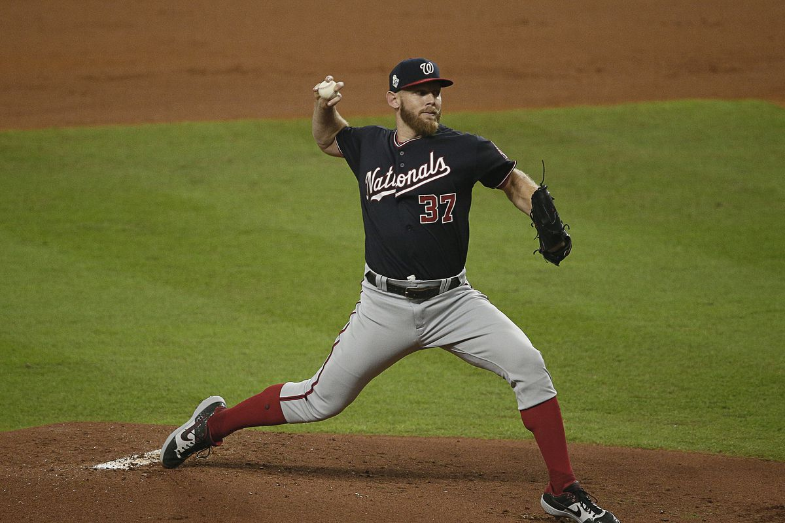
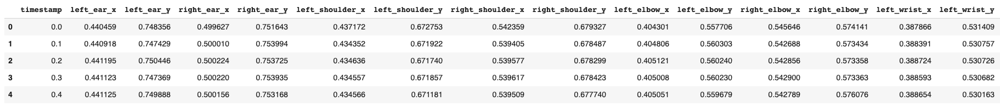
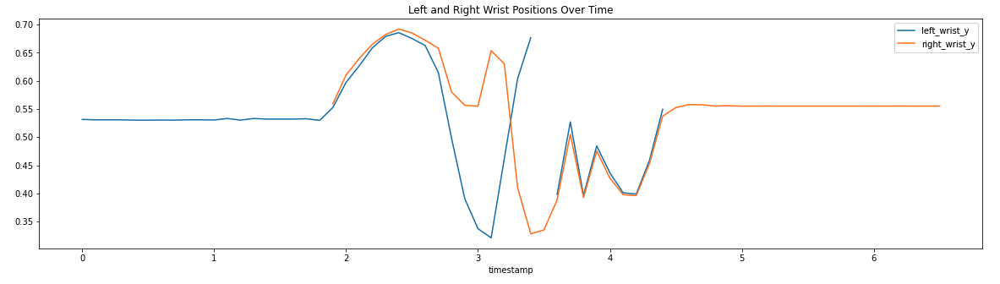
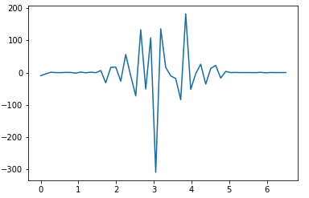

# SportsAI

Given an input video of any sports motion (pitch, tennis serve, etc.), this program can analyze mutliple joints and find points of stress/jerk. In other words, we can deduce injury risk. A sample video is provided for analysis. This video is a ~6 second .mp4 file of a baseball pitch. All videos must only contain one person for the program to work. You can start with a baseball pitch like the following:

The program is able to detect joints (pose estimation) through the GCP Cloud Vision APIs and then analyzes any sports/exercise video for related injuries. 

You will need a GCP account and a custom bucket with an input video (.mp4 preferably) to run this notebook. The first results provided are that of basic joint annotations:

We can now graph the positions of joints in respect to time:

Using the law of cosines, we can then extract the angles between certain joints:

To deduce injury risk (jerk, also known as the third derivative of position), we can differentiate using a UnivariateSpline:

