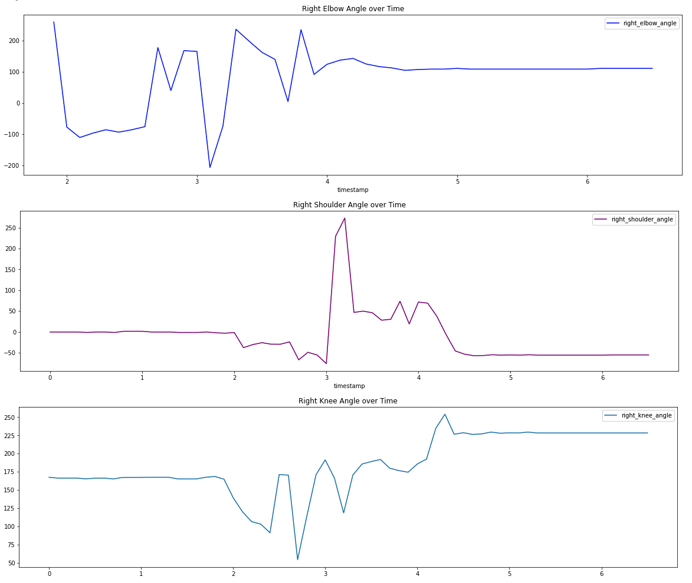

# SportsAI

Credit for the GCP imports and joint annotation extraction code goes to Dale Markowitz - https://towardsdatascience.com/can-ai-make-you-a-better-athlete-using-machine-learning-to-analyze-tennis-serves-and-penalty-kicks-f9dd225cea49

Given an input video of any sports motion (pitch, tennis serve, etc.), this program can analyze mutliple joints and find points of stress/jerk. In other words, we can deduce injury risk. A sample video is provided for analysis. This video is a ~6 second .mp4 file of a baseball pitch. All videos must only contain one person for the program to work. You can start with a baseball pitch like the following:

The program is able to detect joints (pose estimation) through the GCP Cloud Vision APIs and then analyzes any sports/exercise video for related injuries. 

You will need a GCP account and a custom bucket with an input video (.mp4 preferably) to run this notebook. The first results provided are that of basic joint annotations:

We can now graph the positions of joints in respect to time:

Using the law of cosines, we can then extract the angles between certain joints:

To deduce injury risk (jerk, also known as the third derivative of position), we can differentiate using a UnivariateSpline:

The above graph quanitifes the jerk or joint stress over time. If pitches have high jerk (especially on multiple occasions), it can become a direct cause of injury! As you can see, at roughly 3 seconds, the shoulder had the highest jerk. If an injury or "tweak" occurs, it would most likely be at this time. To reduce injury risk during pitching, it is more important to smooth out this motion. In other words, prevent drastic minimas or maximas on this graph.

Credit for the GCP imports and initial code goes to Dale Markowitz - https://towardsdatascience.com/can-ai-make-you-a-better-athlete-using-machine-learning-to-analyze-tennis-serves-and-penalty-kicks-f9dd225cea49
